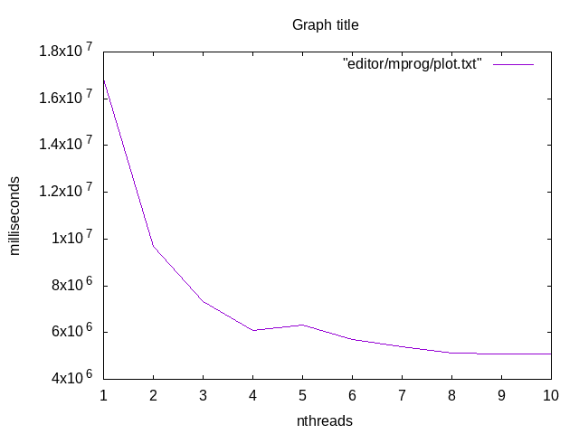

# This is a multithreading research
This is a research about multithread efficiency

## To build a project, you should type
```
git submodule init
git submodule update
cmake -S ./ -B build/
```

## To build a project with sanitizers
```
cmake -S ./ -B build/ -DSANITIZERS=1
```

## To run every test
```
cd build
make run_every_test
```

## To run every benchmark
```
cd build
make run_every_bench
```

## To get research
```
chmod +x mprog.sh
./mgprog.sh
```

## What results I got
### When size is less than L0 cache

### When size is less than L1 cache

### When size is less than L2 cache

### When size is more than L2 cache
